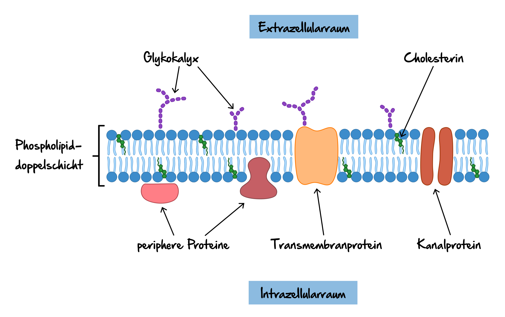

## 2 Elektrische Aktivität eines Muskels
	- Wichtig für die Entstehung des bioelektrischen Potentials sind die **Zellmembran der Muskelfaser** (Sarkolemm) mit ihren Ionenkanälen und die Konzepte von Entstehung und Ausbreitung
	- ### 2.1 Sarkolemm
		- Die Zellmembran ist eine Lipid-Doppelschicht, dessen hydrophobe, lipide Enden sich gegenüberstehen, während die hydrophilen, kugelförmigen Köpfe nach außen zeigen
		- 
		-
		-
		- *Skizze von ihm: Nerv, Neuromuskul're Endplatte, extra/intra- zellulärer Raum, Ionenkanal*
		- **Aufgabe der Zellmembran** ist es, den freien Fluss von Ionen zu verhindern, dies geschieht durch ihre sogenannte **selektive Permeabilität**
			- d.h. Wassermoleküle und bestimmte Ionen können lediglich unter bestimmten Bedingungen durch bestimmte Poren (Ionenkanäle) in der Membran gelangen
		- **Ionen**, die für die bioelektrische Aktivität verantwortlich sind, sind:
			- $\text{Na}^+$ - Natrium
			- $\text{K}^+$ - Kalium
			- $\text{Cl}^-$ - Chlor
			-
		- ##### Endplatte
		- 
		-
		-
	- ### 2.2 Ionenkanäle
		- Ein Ionenkanal kann sowohl offen als auch geschlossen oder inaktiv sein. Ist der Muskel entspannt, sind die Ionenkanäle geschlossen, während eine Stimulation das öffnen der Kanäle bewirkt
		- Jeder Ionenkanal lässt nur eine Art Ion oder Molekül passieren
			- Lüge
		- Es existieren Ionenkanäle, die wie eine Pumpe arbeiten und welche, die als Schleusentor fungieren
		- 
		- *Na raus, K rein, Konzentrationsgradient, elektrischer Gradient*
		- Durch die Ionenflüsse entsteht eine Potentialdifferenz zwischen den extra- und intrazellulären Raum
			- Das intrazelluläre Potential ist negativ $(\phi_i)$
			- das extrazelluläre Potential ist positiv $(\phi_e)$
			- Das Transmembranpotential $V_m = -70 \text{mV}$ (Ruhepotential)
	- ### 2.3 Aktionspotential
		- _Definition_: Unter Aktionspotential (AP) versteht man eine **vorübergehende charakteristische Abweichung** des Transmembranpotentials vom Ruhepotential, hervorgerufen durch ein chemisches Ungleichgewicht als Reaktion auf eine Stimmulation
		- ![Aktionspotential • Ablauf und Potentialverlauf · [mit Video]](https://d1g9li960vagp7.cloudfront.net/wp-content/uploads/2021/03/neu_Aktionspotential_WP-Bilder-1024x576.jpg)
		- ![Aktionspotential • Ablauf und Potentialverlauf · [mit Video]](https://d1g9li960vagp7.cloudfront.net/wp-content/uploads/2021/03/neu_Aktionspotential-Phasen_WP-Bilder-1024x576.jpg){:height 412, :width 719}
		- Keine eindeutige Nomenklatur
		- Form, Amplitude (ca. 100 mV) und Dauer (ca. 4-6 ms) eines Aktionspotentials sind durch die Dynamik der Ionenkanäle bestimmt
		- Die vorherige Abbildung beschreiben die Vorgänge in einem kleinen Ausschnitt der Zellmembran einer Muskelfaser (-> Zellmodel)
		- Die Ausbreitung des Aktionspotentials von einem kleinen Ausschnitt über die gesamte Faser wird häufig durch sogenannte Strömungs-Tripole repräsentiert:
		- #### Skizze Nervenweiterleitung Wirbel + - +
		- Die Ströme, die aus der stimulierten Zelle hinaus in die benachbarten Regionen fließen, fungieren als **Stimulus** für diese benachbarten Regionen. Dadurch entsteht rechts und links vom stimulierten Gebiet ebenfalls ein Aktionspotential. Diese Ausbreitung des Aktionspotentials wird mit wandernden Tripolen beschrieben
		- {:height 336, :width 653}
		-
	- ### 2.4 Elektromyografie (EMG) Signale
		- #### Entstehung von EMG Signalen
			- Bisher haben wir lediglich das Transmembranpotential entlang einer einzelnen Faser beschrieben. Dies wird **Muskelfaseraktionspotential** (MFAP) genannt.
			- Das auf der Hautoberfläche gemessene EMG Signal zeigt allerdings nicht einfach nur dieses MFAP. Jede Faser des Muskels gehört einer motorischen Einheit an
				- Jedes MFAP trägt zu den Aktionspotential motorischer Einheiten bei (MUAP)
				- Die Überlagerung (Superposition) aller MUAPs generiert das interferentielle **Elektromyografie** (EMG) Signal
		- #### Messung von EMG Signalen
			- Die Messung kann auf zwei Arten durchgeführt werden
				- **intramuskuläres EMG:**
				  logseq.order-list-type:: number
					- Eine **Nadelelektrode** wird am zu untersuchenden Muskel eingeführt, mit der das bioelektrische Potential im Muskel oder direkt auf der Oberfläche des Muskels gemessen wird.
					  logseq.order-list-type:: number
				- **Oberflächen EMG**
				  logseq.order-list-type:: number
					- Auf der Haut über den Muskelbauch wird ein **Elektrodenarray** aufgebracht, welches die Muskelaktivität mit einem gewissen Abstand zum Muskel aufnimmt.
					  logseq.order-list-type:: number
					- Hier sind die Eigenschaften des den Muskel und die Oberfläche trennenden Gewebes (Fett und Haut) wichtig
					  logseq.order-list-type:: number
					- Dieses Gewebe verhällt sich wie ein Volumenleiter, der das MFAP an die Oberfläche transportiert
					  logseq.order-list-type:: number
			- Je nach Methode befinden sich die gemessenen EMG Signal in einem Bereich zwischen $50 \mu V$ und $30 \mu V$
		- #### (i) 1D EMG Signal
			- ##### Einkanal EMG Signal
				- einzelnes Elektrodenpaar
				- Messung an einem bestimmten Punkt gegen ein entferntes Refernzpotential (meist 0)
				- Messung über eine bestimmte Zeitspanne
				- **Wirwarr Signal $V_m$ über Zeit**
				- Den Betrag des gemessenen Potentials nennt man gleichgerichtetes EMG Signal
			- #### Multikanal EMG Signal
				- lineares Elektrodenarray bestehend aus $n$ Elektroden entlang der Muskelfaserrichtung auf der Hautoberfläche angebracht.
				- Möglichkeit $n$ monopolare oder $(n-1)$ differentielle/bipolare EMG Signale aufzunehmen
				- man erhält die Potentialverteilung über die Zeit in einem 1D-Raum
				- **Plot von mehreren Signalen übereinander**
		- #### (ii) 2D Oberflächen EMG Signal
			- Erweiterung des linearen Elektrodenarrays zu einem 2D Elektrodengitter
		- #### (iii) Probleme bei der EMG Messung
			- Die Position der Elektroden beeinflusst das EMG Signal
			- (Stör-)Geräusche beeinflussen das EMG
			- Nebensignaleeffekte (cross talk)
			- Eigenschaften des Volumenleiters
		-
	- Die Änderung des Potential durch die Applizierung von elektrischen Strom $I_e$ kann mithilfe des Membranwiderstandes $R_m$ verschrieben werden
		- $$ V_m = R_m \cdot I_e$$
	-