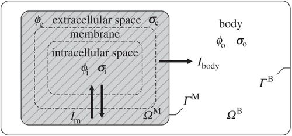

# 3 Muskelfasermodell
	- **Zellmodell**: Entstehung des Aktionspotentials einer einzelnen Muskelfaserzelle
	- **Bidomain Modell**: Ausbreitung des elektrischen Signals in beliebigem Raum (3D Kontinuumsmodell)
	- ## 3.1 Zellmodell
		- Zur mathematischen Modellierung der Zelle, wird diese als elektrischer Schaltkreis betrachtet:
			- Die Kapazität der Zellmembran verzögert dabei die Ausbreitung des Signals
			- Unter der Annahme, dass die Kapazität konstant ist, kann die Überschussladung mit in Verbindung gebracht werden über: 
			  $Q = C_m V_m, \quad [C_m] = \frac{C}{V}$
			- $\frac{dQ}{dt} = C_m \frac{d V_m}{dt}$
			- Die Änderung des Potentials durch die Applizierung von elektrischem Strom $I_e$ kann mithilfe des Membranwiderstands beschrieben werden
	- Bem:
		- Sowohl $C_m$ als auch $R_m$ sind abhängig von der Größe der Overfläche der Zellmembran $A_m$:
			- spezifische Membrankapazität: $c_m = \frac{C_m}{A_m}$
			- spezifischer Membranwiderstand: $r_m = \frac{R_m}{A_m}$
			- Die Membranzeitkonstante $\tau_m = \frac{R_m \cdot C_m}{(\text{vlt.}A_m^2)} = r_m \cdot c_m$ definiert die Zeitskala für Änderungen des Membranpotentials (10 - 100 ms)
		- ### 3.1.1 Nernst Gleichung
			- In biologischen Systemen trennen Zellmembranen Bereiche unterschiedlicher Ionenkonzentrationen. Ist die Membran für ein bestimmtes Ion selektiv permeabel, wird es entlang des Konzentrationsgradient diffundieren, gleizeitig entsteht aber, da das Ion geladen ist, eine Spannung (Ruhemembranpotential)
			- Mit der Nernst-Gleichung lässt sich die Gleichgewichtslage dieses Vorgangs beschreiben
				- $$ E_i = \frac{v_T}{z} \ln \left( \frac{[\text{outside}_i]}{[\text{inside}_i]} \right)$$
					- $E_i$ Nernst-Potential
					- $v_T$ Konstante (thermische Energie der Ionen)
					- $z$ Anzahl der zusätzlichen Protonen
					- $[\text{outside}_i]$, $[\text{inside}_i]$ Konzentration von Ion $i$ innerhalb und außerhalb der Zelle
			- Das Nernst-Potential beschreibt das Potential, welches notwendig ist, damit ein geladenes Ion die Membran überwindet
			- Im **thermodynamischen Gleichgewicht**:
				- $$ \text{Membranpotential} = \text{Nernstpotential aller individuellen Ionen}$$
		- ### 3.1.2 Membranstrom
			- Der Membranstrom $I_{\text{Ion}}$ ist definiert als die Summe aller durch die Ionenkanäle fließender Ströme:
			- id:: 653898ce-0f97-4f19-a2b5-c940e0e4de69
			  $$ I_{\text{Ion}} = I_{\text{Na}^+} + I_{\text{K}^+} + I_{\text{L}} = \sum_i I_i$$
			- Die Strommenge, die durch jeden Ionenkanal fließt ist gleich der Leitfähigkeit dieses Kanals $g_i$ multipliziert mit der treibenden Kraft:
				- $$ I_{\text{Ion}} = \sum_i I_i = \sum_i g_i \cdot (V_m - E_i)$$
			- **Wichtig:**
				- Die Leitfähigkeit eines Ionenkanals (Schleusenvariable) ist abhängig von der Menbranspannung. D.h., Änderung der Leitfähigkeit mit der Zeit führen zu komplexer, nichtlinearer Dynamik
			- Ionenkanäle, die als Pumpen fungieren, sind meist weniger effizient und die Ströme werden unter einem sogenannten Verluststrom $I_L$ zusammengefasst. Meist ist ihre **Leitfähigkeit** konstant
			- $$ I_L = \bar{g}_L \cdot (V_m - E_L)$$
		- ### 3.1.3 Hodgkin-Huxley Modell
			- Hodgkin und Huxley haben 1952 Experimente an dem Riesenaxon eines Tintenfisch durchgeführt -> Nobelpreis
				- Die Zellmembran wurde als Schaltkreis beschrieben
				- {:height 322, :width 406}
			- (*Notizen:* $I_p$ durch $\phi_i$ und $\phi_e$ )
			- Die Änderungsrate des Transmembranpotentials ist proportional zu der Rate mit der sich im Extrazellulären Raum aufbaut (Strom, der in die Zelle eintritt)
				- -> Kapazität ist umgefähr Konstant
			- $$ \begin{align} \text{Hinenfließender Strom} &= \text{Membranstrom} + \text{externer Strom einer Elektrode} \\
			  c_m \frac{\partial V_m}{\partial t} &= -I_{\text{Ion}} + \frac{I_{\text{ext}}}{A} \end{align}$$
			- #### i) Leitfähigkeit des Kaliumkanals
				- $$g_{\text{K}^+}(V_m, t) = \bar{g}_{\text{K}^+} n(V_m)^4$$
				- $\bar{g}_{\text{K}^+}$ konstante Schleusenvariable
				- $n$ **Wahrscheinlichkeit**, dass Ionenkanal offen ist
					- $$ \frac{\partial n}{\partial t} = \frac{n_{\infty} - n}{\tau_n}$$
						- $n_{\infty}$ Wert im stationären Zustand
						- $\tau_n$ Zeitkonstante mit der $n$ auf Änderungen von $V_m$ reagiert
					- ##### Interpretation von $n$:
						- Wahrscheinlichkeit, dass Kaliumkanal offen ist
						- $1-n$, Wahrscheinlichkeit das Kaliumkanal geschlossen ist
						- Wenn Kanal offen ist, schließt er sich mit der Rate $\beta(V_m)$
						- Wenn Kanal geschlossen ist, öffnet er sich mit der Rate $\alpha(V_m)$
						- ```mermaid
						  graph LR;
						  A[offen n]<-->B[geschlossen 1-n];
						  ```
							- $$ \frac{\partial n(V_m)}{\partial t} = \alpha(V_m) \cdot (1 - n(V_m))-\beta(V_m) \cdot n(V_m) $$
							- Gleichgewichtszustand: $$\frac{\partial n}{\partial t} = 0$$
								- $$\begin{align}
								  0 &= \alpha \cdot (1 - n_\infty) - \beta \cdot n_\infty \\
								  &= \alpha - \alpha n_\infty - \beta n_\infty \\ \end{align}$$
								- Somit $n_{\infty} = \frac{\alpha}{\alpha + \beta}$
							- Weiter gilt:
								- $$\begin{align}
								  \frac{\partial n}{\partial t} &= (\alpha + \beta) \left[ \frac{\alpha}{\alpha + \beta} \cdot (1-n) - n \frac{\beta}{\alpha + \beta} \right] \\
								  &= \frac{1}{\tau_n} \left[ n_\infty - n \right] = \frac{n_\infty - n}{\tau_n}
								  \end{align}$$
							- Bemerkung
								- Sollte $\alpha + \beta$ groß sein, dann ist die Zeitkonstante klein und $n$ nährt sich $n_\infty$ rasch an
			- ### ii) Leitfähigkeit des Natriumkanals
				- Ähnlich wie beim Kalium:
					- $$g_{\text{Na}^+}(V_m, t) = \bar{g}_{\text{Na}^+} m(V_m)^3 h(V_m, t)$$
					- mit
						- $$\begin{align}
						  \frac{\partial m}{\partial t} &= \frac{m_\infty - m}{\tau_m}\\
						  \frac{\partial h}{\partial t} &= \frac{h_\infty - h}{\tau_h}
						  \end{align}$$
					- #### Zusammenfassend:
						- $$ \begin{align} c_m \frac{\partial V_m}{\partial t} =-& 
						  \bar{g}_{\text{Na}^+} n(V_m)^4 \\
						  -&\bar{g}_{\text{K}^+} m(V_m)^3 h(V_m, t) \\
						  -&\bar{g}_{\text{L}} (V_m - E_L) \end{align}$$
						- Mit Gleichungen (6), (7) und (8)
					- Unbekannte
						- $$y(t) = [V_m(t), m(V_m), h(V_m), n(V_m)]$$
					- Materialparameter
						- $$E_i, I_{\text{ext}}, A, c_m, m_\infty, n_\infty, h_\infty, \tau_m, \tau_n, \tau_h$$
					- ODE
						- $$\dot{y}(t) = f(y(t), t)$$
	- ## 3.2 Bidomain Modell
		- ### 3.2.1 Modellannahme
		- *Skizze: In Körper, Membran zwischen extr- und intra Zellulärer Raum*
		- $\phi_e$, $\phi_i$, $\sigma_e$, $\sigma_i$ und Strom $I_m$, Aussen $\phi_o$ und $\sigma_o$
		- Das Muskelgewebe wird mithilfe folgenden 6 Annahme modelliert:
			- Zwei sich gegenseitig durchdringende Gebiete, die lediglich durch eine semi-permeable Membran getrennt sind, repräsentieren:
			  logseq.order-list-type:: number
				- die Muskelfaserzellen (intrazellulärer Raum, Index $i$)
				  logseq.order-list-type:: number
				- die Umgebung (extrazellulärer Raum, Index $e$)
				  logseq.order-list-type:: number
			- Ein dritter Gebiet welches zum Beispiel das den Muskel umbegende Gewebe beschreibt, z.B. Fett & Haut, kann zuätzlich eingeführt werden, Index $o$
			  logseq.order-list-type:: number
			- Intra- und extrazellulärer Raum nehmen den selben physikalischen Raum ein. Das dritte Gebiet wird als benachbarter Raum definiert.
			  logseq.order-list-type:: number
			- Jedes Gebiet hat seinen eigenen Konduktivitätstensor $\mathbf{\sigma}$. Es gibt also $\mathbf{\sigma_i}, \mathbf{\sigma_e}, \mathbf{\sigma_o}$ und $\phi_i$, $\phi_e$, $\phi_o$
			  logseq.order-list-type:: number
			- Folgende zwei Stromflüsse sind erlaubt
			  logseq.order-list-type:: number
				- Transmembranströmung $I_m$ über die Membran zwischen intra- und extrazellulären Raum, in beide Richtungen
				  logseq.order-list-type:: number
				- Das außen liegende Gebiet nimmt unter normalen Bedingungen Strom $(I_body)$ aus dem extrazellulären Gebiet auf.
				  logseq.order-list-type:: number
			- Kein Stromfluss zwischen interzellulärem Raum und dem Körper
			  logseq.order-list-type:: number
		- ### 3.2.2 Herleitung der Bidomain Gleichung
			- Die Biodomain Gleichungen sind ein System von zwei Gleichungen
				- Die 1. Gleichung ist eine nichtlinear **Reaktionsdiffusionsgleichung**, die für das Transmembranpotential $V_m$ gelöst wird
					- Der nichtlineare Aktionsterm ergibt sich aus der Summe der Ionenströme durch die Membran
				- Die 2. Gleichung beschreibt das **extrazelluläre Potential** $\phi_e$, welches aus gegebenem $V_m$ resultiert.
					- Verschieden Lösungsverfahren, parabolisch und nicht, wenn mit gleichem Löser dann wird das eklig
- ## VL -30.10
	- Wdh. Bidomain Modell
	- 
	- $V_m = \phi_i - \phi_e$
	- #### Ohmsche Gesetz
		- $$ J = \sigma E = \frac{E}{R}$$
		- mit $J$ Stromdichte, $E$ elektrische Feldstärke, $\sigma$ Konduktivität
	- #### Annahmen
		- quasistatische Bedingungen, kann die elektrische Feldstärke $E$ durch den negativen Gradienten des Potentialfeldes $\phi$ ausgedrückt werden:
			- $$ E = - \nabla \phi$$
		- Einsetzen dieser Gleichung in das Ohmsche Gesetz ergibt für den intra- und extrazellulären Raum
			- $$\begin{align*}
			  J_i &= -\sigma_i \nabla \phi_i \\
			  J_e &= - \sigma_e \nabla \phi_e
			  \end{align*}$$
		- Die Änderung der Stromdichte in jedem der Gebiete muss den gleichen Betrag, aber mit entgegengesetztem Vorzeichen haben
		- $$ - \nabla J_i = \nabla J_e \Leftrightarrow \nabla\cdot [\sigma_i \nabla \phi_i] = -\nabla \cdot [\sigma_e \nabla \phi_e]$$
		- Um das Prinzip der Erhaltung der Stromdichte zu beachten, muss der Stromfluss durch die Membran ($A_m I_m$) gleich der Änderung der Stromdichte in den beiden Gebieten sein
		- $$\begin{align} 
		  -\nabla \cdot [\sigma_e \nabla \phi_e] &= A_m I_m \\
		  \nabla\cdot [\sigma_i \nabla \phi_i] &= -\nabla \cdot [\sigma_e \nabla \phi_e] \end{align}$$
		- **Rohform der Bidomain Gleichung**
		- $A_m$ Obeflächen-Volumen Verhältnis der Zellmembran
		- $I_m$ Transmembrandichte pro Flächeneinheit
			- $$I_m = c_m \frac{\partial V_m}{\partial t} + I_{ION}$$
			- $c_m$ Kapazität pro Flächeneinheit
			- $I_{ION}$ Summe alle individueller Ströme über die Membran
		- ### Erste Bidomain Gleichung
		- Gleichung $\phi_i = V_m + \phi_e$ ->
			- $$ \nabla [\sigma_i \nabla V_m ] + \nabla[ \sigma_i \nabla \phi_e]= A_m (\sigma_n \frac{\partial V_m}{\partial t} + I_{ION} V_m)$$
		- ### Zweite Bidomain Gleichung
			- $$\nabla \cdot [\sigma_i \nabla V_m] + \nabla \cdot [(\sigma_e + \sigma_i) \nabla \phi_e] = 0$$
			- Man kann hier noch die Outside als 3. Gleichung formulieren $\nabla(\sigma_o \nabla \phi_o) = 0$
		- ### Randbedingungen (der Bidomain Gleichungen mit einem externen Körper)
			- kein Stromfluss zwischen intrazellulären Raum und Körper
			  logseq.order-list-type:: number
				- logseq.order-list-type:: number
				  $$[\sigma_i \nabla \cdot \phi_i] \cdot n^M$$
				- mit Normalenvektor $n^M$ der Muskeloberfläche $T_M = \partial \Omega^M$
				  logseq.order-list-type:: number
				- mit $\phi_i = V_m + \phi_e$ folgt
				  logseq.order-list-type:: number
				- logseq.order-list-type:: number
				  $$[\sigma_i \nabla \cdot V_m] \cdot n^M = - (\sigma_i \nabla \phi_e) \cdot n^M $$ auf $\Gamma^M$
			- Stromfluss zwischen extrazellulären Bereich und Körper
			  logseq.order-list-type:: number
				- logseq.order-list-type:: number
				  $$(\sigma_e \nabla \phi_e) \cdot n^M = - (\sigma_o \nabla \phi_o) \cdot n^B$$
				- mit $n^B$ Vektor auf Body (also innen und aussen)
				  logseq.order-list-type:: number
			- Um Stetigkeit zu erhalten fordern wir an einem Punkt der Muskeloberfläche
			  logseq.order-list-type:: number
				- logseq.order-list-type:: number
				  $$\phi_e = \phi_o $$ auf $T^M \cap T^B$
		- #### Fasern
			- repräsentative Faser MU1
			- repräsentative faser MU2
		- ### 3.2.4 Monodomain Gleichung
			- $\sigma_i = k \cdot \sigma_e \to k = \frac{\sigma_i}{\sigma_e}$
			- Einsetzen in die 2. Biodomain-Gleichung
			- $$\nabla \cdot [\sigma_i \nabla V_m] + \nabla \cdot [(1 + \frac{1}{k})\sigma_i \nabla \phi_e] = 0$$
			- $$\nabla \cdot [\sigma_i \nabla V_m] = - \frac{k+1}{k} \nabla \cdot [\sigma_i \nabla \phi_e]$$
			- einsetzen in **1. Bidomain Gleichung**
				- $$  - \frac{k+1}{k} \nabla \cdot [\sigma_i \nabla \phi_e] + \nabla[ \sigma_i \nabla \phi_e]= A_m (\sigma_n \frac{\partial V_m}{\partial t} + I_{ION} V_m)$$
				- effektive Konduktivität $\sigma_{eff} = \frac{\sigma_i - \sigma_e}{\sigma_i + \sigma_e}$
				- $$   \nabla \cdot [\sigma_{eff} \nabla \phi_e] = A_m (\sigma_n \frac{\partial V_m}{\partial t} + I_{ION} V_m)$$
-