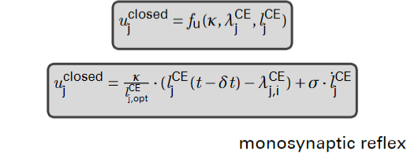
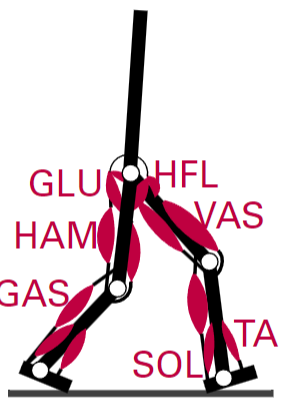

- 
- ## Goal
	- Neurons, Wires, CPU
	- Reflexes and commands
	- Generate motor command for each muscle based on control goal and current state of the system (sensor signals)
-
- ## Human motor controll
	- id:: 6566e916-f296-402d-9170-1d6d3337d241
	- ### Theories
		- #### Reflex Theory
			- *Sherrington 1906*
		- #### Motor Programm Theory
			- Adaptive and generalized MP
		- #### Internal Model Theory
			- CNS contains knowledge about properties of the body and of the external world
		- #### Hierarchical theory
			- Cortical centers control movement in a top-down manner
		- #### Dynamical Systems theory
			- movement to control DOF
			- mov. patterns self-organize
			- synergies
	- ### Merkspruch
		- Reflexiver MP interveniert Hier Archächologische Dynamo
	- Patella
-
- ## Degrees of freedom problem
	- COT (ml $O_2$ $kg^{-1}$ $km^{-1}$) against Speed
-
-
-
- ## How to use sensory information
	- ### Reinforcement learning
		- Use SI (sensory Information) as input to Blackbox
		- ```mermaid
		  graph LR;
		      A(state information)-->B(RL policy);
		      C(sensory information)-->B;
		  ```
	- ### Central Pattern Generator
		- Use SI to modulate FF-Signal
	- ### $\lambda$-Controller
		- Compare SI to desired SI
	- ### Reflex Controller
		- Use sensor signals directly to generate stimulation
- ## Simple "low level" - control
- {:height 157, :width 392}
- ## Simple "high level" - control
	- Modelreduktion
	- EPM (Equilibrium Point Controll)
- ## Reflex control: walking model
- 
	- GLU
		- Gluteal Muscle
	- HAM
		- Hipp-Activation-Muscle *I guess*
	- GAS
		- Gastrocnemius
	- HFL
		- Hipp-Flexor-L
	- VAS
		- Vastus Lateralis
	- SOL
		- Soleus
	- TA
-
-