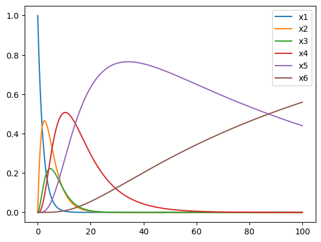

- Molekültypen Chem. Reaktionen
	- $\cdot \to \empty$ Abbau
	- $\empty \to \cdot$ Synthese
	- $\cdot + * \leftrightarrow \Delta$
	- $* + * \leftrightarrow *_2$
	-
- Reaktionsvolumen (konstant)
- *Skizze* Box mit $\cdot, \Delta, *$
- ### homogenes Reaktionssystem
- zeitlicher Verlauf, keine räumliche Auflösung
-
- Zeitverläufe für Molekültypen bei geg. chem. Reaktionen
- Geschwindigkeiten f. Reaktionen
-
- ## Michaelis-Menten Reaktion
- $$\mathrm E + \mathrm S\,\underset{k_1'}{\overset{k_1}{\rightleftharpoons}}\,\mathrm{ES}\,\overset{k_2}{\rightarrow}\,\mathrm P + \mathrm E $$
- Von Wiki, Radde benutzt $k_1 = c_1$, $k_1' = c_2$, $k_2 = c_3$
- Zustand: $$X = \begin{pmatrix} S \\ E \\ C \\ P \end{pmatrix}$$
- Reaktionen
	- $$\nu_1 = \begin{pmatrix} -1 \\ -1 \\ +1 \\ 0 \end{pmatrix}, \nu_2 = \begin{pmatrix} 1 \\ 1 \\ -1 \\ 0 \end{pmatrix}, \nu_3 = \begin{pmatrix} 0 \\ 1 \\ -1 \\ 1 \end{pmatrix}$$
- #### Reaktionspropensities
	- $$\begin{align} a_1(X) &= c_1 \cdot X_1 \cdot X_2 \\
	  a_2(X) &= c_2 \cdot X_3 \\
	  a_3(X) &= c_3 \cdot X_3 \end{align}$$
	- $a_j(x) dt$ Wahrscheinlichkeit f. Reaktion $j$ in $dt$
- $$X \to X + \nu_j$$ beschreibt Reaktion $j$
- $P(x,t)$ W für Zst. $x$ zur Zeit $t$
- ## Chemische Mastergleichung
- CME ist DGL System f. $P(x,t)$ $x$ Mikrozustand
- $$P(x, t +dt) = \underbrace{(1 - \sum_{j=1}^M a_j(x) dt) P(x,t)}_{\text{In $x$ zur Zeit $t$ und keine Reaktion}} + \underbrace{\sum_{j=1}^M a_j(x- \nu_j) dt P(x - \nu_j, t)}_{\text{In Zst. $x - \nu_j$ zur Zeit $t$ über Reaktion $j$ in $dt$}}$$
-
- $$\frac{P(x, t +dt)-P(x,t)}{dt} = - \sum_{j=1}^M a_j(x) P(x,t) +\sum_{j=1}^M a_j(x- \nu_j) P(x - \nu_j, t)$$
- lineare DGL für W, im Mikrozustand $x$ zu sein
	- $$\dot{P}(\vec{x}, t) = Q \cdot P(\vec{x}, t)$$
	- $\vec{x}$ Mikrozustand Vektor mit Lösung $P(\vec{x}, t) = e^{Qt} P(\vec{x}, 0)$
- Zeitstetige Markov-Prozesse (Zustandstsübergangsgraph welcher stetig in der Zeit ist)
-
- #### Beispiele
	- $$\begin{align}
	  A \overset{C}{\rightarrow} \empty \quad X = A \quad X(0) = 5
	  \end{align}$$
	- ##### Zustandsübergangsgraph
	- |$x$:|5 $(X^1)$$\: \overset{5c}{\to}$|4$(X^2)$$\: \overset{4c}{\to}$|3$(X^3)$$\: \overset{3c}{\to}$|2$(X^4)$$\: \overset{2c}{\to}$|1$(X^5)$$\: \overset{1c}{\to}$|0|
	- $\nu=-1$ $a(X) = c \cdot X$
	- $$\begin{align}
	  P(X^1, t) &= -5c \cdot P(X^1, t) \\
	  P(X^2,t) &= -4c P(X^2, t) + 5c P(X^1, t) \\
	  P(X^3,t) &= -3c P(X^3, t) + 4c P(X^2, t) \\
	  \vdots \\
	  P(X^6, t) &= c \cdot P(X^5, t)
	  \end{align}$$
	- Oder kompakt als Matrix Vektor
	- $$ \frac{d}{dt} \begin{bmatrix} P(X^1, t) \\ P(X^2, t) \\ \vdots \\ P(X^6, t) \end{bmatrix} = 
	  \begin{bmatrix} -5c & 0&0&0&0&0 \\ 5c&-4c&0&0&0&0 \\
	  0 & 4c & -3c & 0 & 0 & 0 \\ &&\ddots&&&\\ &&&\ddots&&\\0&0&0&0&c&0 \end{bmatrix} \begin{bmatrix} P(X^1, t) \\ P(X^2, t) \\ \vdots \\ P(X^6, t) \end{bmatrix}$$
	- 
	- #### Beispiel 2
		- Gleich bleibendes $c$
	- #### Beispiel 3
		- $$ A \underset{c_2}{\overset{c_1}{\rightleftharpoons}} B$$
		- $$\begin{align} \nu_1 &= \begin{bmatrix} -1 \\ 1 \end{bmatrix} \qquad & \nu_2 = \begin{bmatrix} 1 \\ -1 \end{bmatrix} \\
		  a_1(X) &= c_1 X_1 \qquad & a_2(X) = c_2 \cdot X_2 \end{align}$$
		- Bei $X(0) = \begin{bmatrix} 2 \\ 0 \end{bmatrix}$ 
		  Drei Mikrozustände $X^1, X^2, X^3$
		- $$\dot{P} = \begin{bmatrix} -2c_1 & c_2 & 0 \\ 2c_1 & -(c_1 + c_2) & 2c_2 \\ 0 & c_1 & -2c_2\end{bmatrix} \cdot P$$
	- #### Beispiel 4
		- Für Michaelis-Menten
		- Konvergenz zur Verteilung zu letztem Zustand (stochastische Konvergenz) zusätzlich absorb. Zst. $X^5$, keine Reaktion mehr möglich
		-