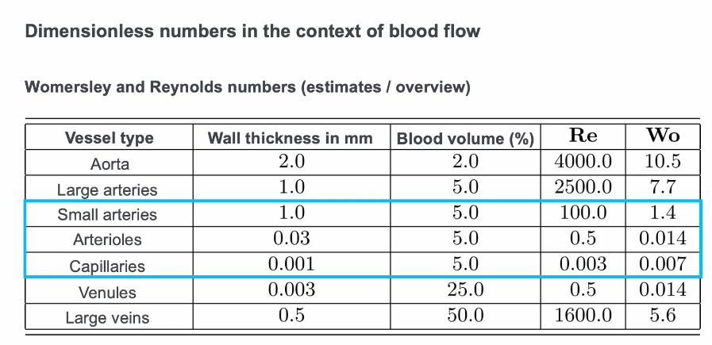

## Questions to prepare for Session 2 (22.1.24, 11:30)

### Questions for Chapter 01 (could also be exam questions) 
*Material: Chapter 01 A/B/C videos and presentation slides; as support: lecture notes chapter 2.3/3.1-3.3 (3.3 until the first equation (Eq. 37) is enough, the subsequent details are extra for those who are interested)*

1) What are heart **valves** good for?
   - Buiding up the pressure to maintain blood flow and enable blood circulation.
2) What is the **average stroke volume** per heart beat in humans? (Compute from info in the presentation/slides)
   - 71 - 86 ml
   - $\frac{5 \text{liter}}{70 \text{heart-bpm}}$
3) What is the Windkessel effect and what effect does it have on flow in the microcirculation?
    - It enables constant flow in the capillaries by the elasticity of the atteries. 
4) How large are red blood cells?
   - Small but down to capillary they are on the same order of magnitude
   - There are some capillary where red blood cells need to squeeze through
   - Oxygen can diffuse out of red blood cells and hämoglobin 
5) How could red blood cells be represented in a two-phasic material approach to blood flow modeling?
   - Blood plasma and blood cells -> Expensive simulation
   - "Alternative" one phase 
6) Blood behaves as a slightly shear-thinning fluid. What would a shear-thickening fluid behave like? Do you know an example of such a material?
   - If one layer is slightly faster then the other than there is shear-stress
   - Blood as Newtonian fluid is good for high-shear rates
7) What is the characteristic element of pulsatile tube flow at $W_0 \approx8$?
   - the inside is slower in changing direction
   - even faster would be yielding a increasingle small boundary behaviour
8) Fully-developed unidirectional non-oscillatory tube flow at low Reynolds number is also called Poiseuille flow. What additional effect is considered when thinking of a system characterized by the Womersley number?
   - Time derivative of the axial velocity (slightly more complex)

### Questions for Chapter 02 (could also be exam questions):  

*Material: Chapter 02 video and presentation slides; as support: lecture notes chapter 3.5*
1) What is the general procedure to derive the 1D model and how does 3D information enter to final model?
   - Through the Wormsley number
2) How can the radial fluid velocity at r=R be expressed in terms of the vessel radius?
   - Change of the radius with the respect to time
3) Which fluid boundary conditions have been used to derive the 1D model?
   - 
4) Given that the area is constant what can we say about the flow rate? What is then the only remaining driving force for flow?

## Notes VL 1:

### Part A: Different types of capillaries
Exchange with outside:
* HIGH: Brain, skeletal muscle
* MID: Kidney, Pancreas
* LOW: Liver

### Part B: 
Fahræus-Lindqvist-effect
- In small vessels, RBCs (Red Blood Cells) preferrably occupy the middle of the lumen. Stronger in slow and laminar flow regimes. Leads to reduction of the **apparent viscosity** the smaller the diameter. Breaks if only one blood cell per capillarie - obvi. Dependence of effective viscosity on vessel diameter and hematocrit

$$\begin{align*}
\eta_r & \quad \text{ relative viscosity} \\
H & \quad \text{ hematrocrit} \\
D & \quad \text{ vessel diameter}
\end{align*} $$

### Part C:

#### Navier-Stokes again

$$ \begin{align*}
  \underbrace{\rho \frac{\partial \mathbf{v}}{\partial t}+ \nabla \cdot (\rho \textbf{v} \otimes \mathbf{v})}_{\text{inertia}} 
  - \underbrace{\nabla \cdot \mathbf{\sigma}}_{\text{viscous stress}}
  - \underbrace{\rho \mathbf{b}}_{\text{body forces}} = \mathbf{0}
\end{align*} $$

#### Nondimensionalized NS

$$ \begin{align*}
    v^* &= \mathbf{}
\end{align*} $$

#### Reynold number
$$\text{Re} = \frac{\rho V L}{\mu} $$
with characterstic velocity and length and dynamic viscosity $\mu$.

* Re $> 2050$ flow stays turbulent

#### Womersley number

$$W_o := \frac{L}{2} \left( \frac{\rho \omega}{\mu} \right)^{\frac{1}{2}}$$

#### Dean number

$$ \text{De} := \text{Re} \sqrt{\frac{L}{2 R_c}}$$

#### Péclet Number (mass transprot)

$$ \text{Pe} := \frac{LV}{D}$$

advection dominated for large values against diffusion values for $<1$

## VL: 2

### Equation
$$ \frac{\partial \mathbf{U}}{\partial t} + \frac{\partial \mathbf{F}}{\partial z}(\mathbf{U}) = \mathbf{S}(\mathbf{U}), \quad z \in (0,l), \quad t > 0 $$ 