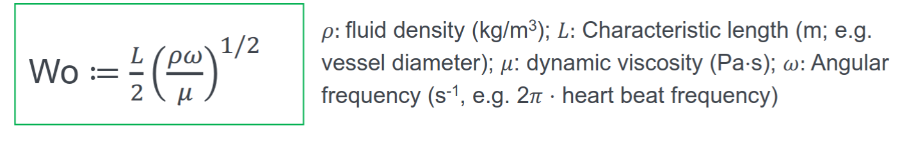
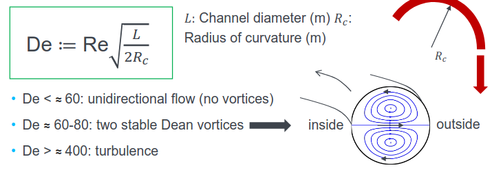
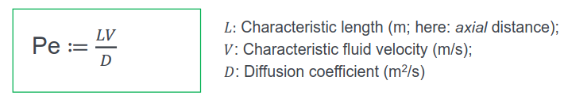
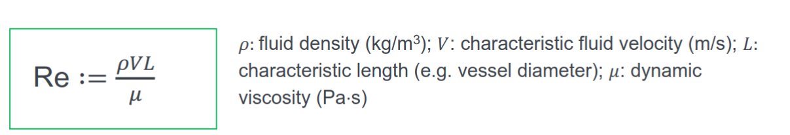
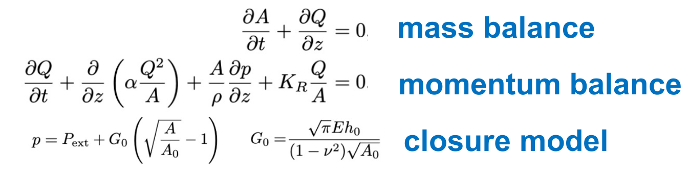
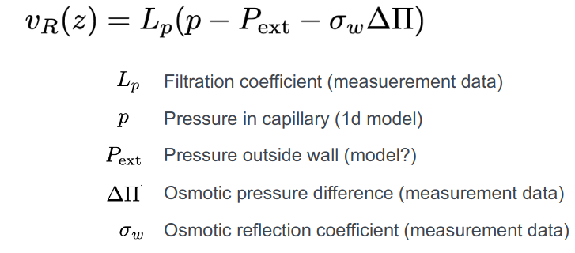
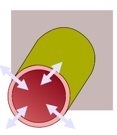

# Summary for oral exam

## Numbers

### Wormsley Number

### Dean Number

### Péclet number

* characterices dominant mass transport mechanism **advection** vs **diffusion**

### Reynold

## Effects

### Fahræhus-Linqvist Effect

RBC travel faster then Plasma, since they align in the middle of the lumen (axial migration) and parabolic profile. Dependent of the Hermatocrit $H$, effective Viscosity $\eta_r$ and vessel diameter $D$.

### Fahræhus Effect

Hermatocrit is smaller in smaller vessels

## Math

$$
\begin{align*}

\underbrace{\rho\frac{\partial\mathbf{v}}{\partial t}+\nabla\cdot(\rho\textbf{v}\otimes\mathbf{v})}_{\text{inertia}}

-\underbrace{\nabla\cdot\mathbf{\sigma}}_{\text{viscous stress}}

-\underbrace{\rho\mathbf{b}}_{\text{body forces}} = \mathbf{0}

\end{align*}
$$

#### Nondimensionalized NS

$$
\begin{align*}

    v^* &= \mathbf{v}/V \\
    \nabla^* &= L\nabla \\
    t^* &= \frac{tV}{L} \\
    p^* &= \frac{pL}{V\mu} \\
\end{align*}
$$

Which yields

$$
\begin{align*}

Re \left(

\frac{\partial\mathbf{v^*}}{\partial t}
+\nabla^* \cdot (\textbf{v}^* \otimes\mathbf{v}^*

\right)

-\nabla^* \cdot (2 \mathbf{D}^*(u^*)-p^* \mathbf{I}) = \mathbf{0}

\end{align*}
$$

### Starlings Law

